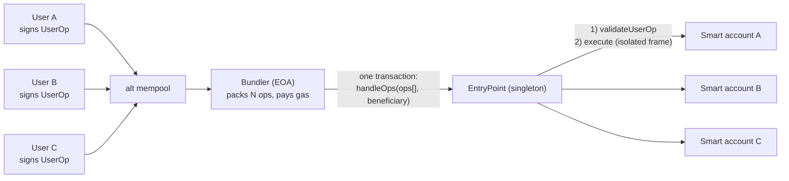
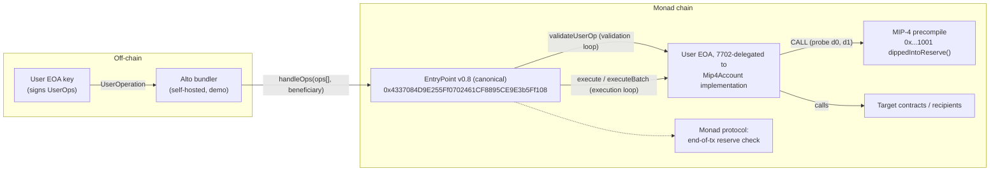

# MIP-4-Aware ERC-4337 Smart Wallet on Monad — Technical Specification

**Status:** Draft v1.0
**Audience:** Developers joining the project. Assumes working knowledge of the EVM (accounts, transactions, calls, reverts, gas); assumes **no** prior knowledge of ERC-4337, EIP-7702, or Monad internals — all three are explained from scratch (§0 and §2).
**Scope:** This document is the single driving specification for the project. It defines why the project exists, how Monad's MIP-4 precompile enables it, the proposed architecture, every component in detail, and the path from reference implementation to real-world adoption.

The key words MUST, MUST NOT, SHOULD, SHOULD NOT, and MAY are to be interpreted as described in RFC 2119.

---

## Table of Contents

0. [Background: ERC-4337 and EIP-7702 in Plain Terms](#0-background-erc-4337-and-eip-7702-in-plain-terms)
1. [Problem Statement](#1-problem-statement)
2. [MIP-4 Primer](#2-mip-4-primer)
3. [Solution Overview & Adoption Story](#3-solution-overview--adoption-story)
4. [Proposed Architecture](#4-proposed-architecture)
5. [Component Specifications](#5-component-specifications)
6. [Detailed Flows](#6-detailed-flows)
7. [Deployment & Operations](#7-deployment--operations)
8. [Production Readiness & Real-World Integration Path](#8-production-readiness--real-world-integration-path)
9. [Risks, Limitations & Open Questions](#9-risks-limitations--open-questions)
10. [Glossary & References](#10-glossary--references)

---

## 0. Background: ERC-4337 and EIP-7702 in Plain Terms

This section is for readers who have never touched account abstraction. It introduces every concept the rest of the document depends on. If you already know ERC-4337 and EIP-7702, skip to §1.

### 0.1 The two kinds of accounts, and why EOAs are limiting

EVM chains have two account types:

| | EOA (Externally Owned Account) | Contract account |
|---|---|---|
| Controlled by | one private key | its code |
| Can initiate transactions | yes | no — can only act when called |
| Custom logic | none — fixed protocol rules | anything: multisig, spending limits, passkeys, recovery |

Everything about how an EOA authorizes actions is hardcoded in the protocol: one ECDSA key, one signature scheme, one nonce, gas paid in the native token from its own balance. Lose the key, lose the account. No batching, no sponsorship, no custom policies.

**Account abstraction** is the umbrella term for letting accounts be controlled by *code* instead of protocol-hardcoded rules — so your wallet can be a smart program while still being able to initiate actions. The two building blocks we use are ERC-4337 (no protocol changes needed) and EIP-7702 (a small protocol change that upgrades EOAs).

### 0.2 ERC-4337: smart accounts without protocol changes

The core problem ERC-4337 solves: contract accounts cannot initiate transactions — someone with an EOA must send the transaction and pay its gas. ERC-4337 standardizes that "someone" so users don't need an EOA of their own:

- **UserOperation ("userop")** — a transaction-like object describing what a smart account wants to do: sender (the smart account address), nonce, calldata to execute, gas limits/prices, and a signature *whose meaning is defined by the account's own code*, not the protocol.
- **Bundler** — an off-chain service maintaining an alternative mempool of userops. It picks up many userops from *different, unrelated users*, packs them into one array, and submits a single real transaction from its own EOA: `EntryPoint.handleOps(ops[], beneficiary)`. It fronts the gas and gets reimbursed plus a margin.
- **EntryPoint** — a singleton, heavily-audited contract deployed at the same well-known address across chains; the canonical version we build on is **v0.8**. It orchestrates every bundle in two phases:
  1. **Validation loop** — for each op, EntryPoint calls the account's `validateUserOp(...)`. The account checks the signature by its own rules and must ensure the EntryPoint holds enough of its funds to pay for the op's gas ("prefund"). Accounts can pre-pay by keeping a **deposit** inside the EntryPoint (`depositTo`); if the deposit is short, validation transfers the difference (`missingAccountFunds`) from the account's balance. If any op fails validation on-chain, the whole `handleOps` call reverts — which is why bundlers simulate validation before including an op.
  2. **Execution loop** — for each op, EntryPoint invokes the account with the op's calldata (typically the account's `execute` or `executeBatch` function) **in an isolated inner call frame**. If that frame reverts, the EntryPoint *catches* the revert: it emits `UserOperationRevertReason` (the revert data) and `UserOperationEvent` with `success = false`, still charges the op's gas from the account's deposit, and **moves on to the next op**. One op's execution failure does not affect the others.
- **Paymaster** (mentioned for completeness; not used in v1) — an optional contract that pays gas on a user's behalf, e.g. for sponsored or ERC-20-denominated gas.

That execution-loop containment — *failed op → recorded, charged, skipped; bundle continues* — is the property this entire project leans on. Keep it in mind for §1.2, where Monad breaks it.



Vocabulary used throughout this doc: an op's **sender** is the smart account; the **bundle** is the array of ops inside one `handleOps` transaction; the **executor EOA** is the bundler's key that signs and pays for that transaction.

### 0.3 EIP-7702: turning an EOA into a smart account

ERC-4337 alone assumes the smart account is a deployed contract at a fresh address. EIP-7702 (shipped in Ethereum's Pectra upgrade; supported on Monad) instead upgrades an **existing EOA** in place:

- The EOA's key signs an **authorization**: "my account should run the code of implementation contract X".
- The authorization is included in a new transaction type (type-4). Once processed, the protocol sets the EOA's code to a 23-byte **delegation designator**: `0xef0100 ‖ <implementation address>`.
- From then on, any call to the EOA executes the implementation's code *in the EOA's own context* — its address, storage, and balance — as if the implementation were deployed there. Think of it as a protocol-level `DELEGATECALL` pointer.
- The account **remains an EOA**: same address, the key still works and can sign new authorizations (including re-delegating or removing the delegation). Nothing is deployed per-user; thousands of EOAs can point at one shared implementation.

Two consequences matter for our design:

1. **Implementations must be delegation-safe.** Since one implementation instance is shared by all delegating EOAs and runs in *their* storage context, it must not rely on constructors or initializers, and ideally holds no storage at all (our guard holds none; see §5.1–5.2).
2. **The account is still an EOA to the protocol.** This is why Monad's EOA-only reserve rule (§1.1) applies to 7702 smart accounts even though they behave like contracts — the crux of this project.

### 0.4 How 4337 + 7702 combine (and why we use both)

EntryPoint v0.8 added native support for 7702-delegated EOAs as userop senders: the account's `validateUserOp` simply checks that the userop signature recovers to `address(this)` — i.e., the EOA's own key signs its userops. The combination gives users:

- their **existing address** (assets, history, approvals intact) upgraded to a smart account;
- smart execution: batching, and — the point of this project — the MIP-4 reserve guard in the execute path;
- the 4337 rails: bundlers submit and front gas, no separate relayer needed, optional paymasters later.

A user onboards with exactly two steps: sign a 7702 authorization delegating to our `Mip4Account` implementation (one type-4 transaction), and keep a small gas deposit in the EntryPoint (§5.3). After that, they interact purely by signing userops.

---

## 1. Problem Statement

### 1.1 Monad's asynchronous execution and the reserve-balance rule

Monad achieves high throughput by decoupling consensus from execution: validators finalize the *ordering* of transactions roughly three blocks (~1.2 seconds) before those transactions are actually *executed*. During that window the protocol has an incomplete view of account state — a user could appear solvent at ordering time while their funds have already been spent by an in-flight transaction.

To keep this safe, Monad enforces a **reserve-balance rule** ([Monad docs: Reserve Balance][ref-reserve]):

> Every EOA must retain a reserve (currently **10 MON**) at the end of any transaction that decrements its balance. If any touched EOA's ending balance falls below its reserve, the **entire transaction reverts** — after all computation has already run.

Properties of the rule that matter for this project:

| Property | Detail |
|---|---|
| Who is subject | EOAs, including **EIP-7702-delegated EOAs** (§0.3 — still EOAs to the protocol) |
| Who is exempt | Plain smart contracts (accounts with deployed code that are not 7702 delegations) |
| When it is checked | At the **protocol level, at end of transaction** — not at the moment of the balance change |
| What happens on violation | The whole transaction reverts; gas is consumed |
| Emptying exception | An undelegated EOA sending its first transaction within a window may fully empty itself. **7702-delegated EOAs do NOT get this exception** |

The check is a *predicate over the transaction's final state*, which has an important consequence: a violation that occurs mid-transaction is **not fatal if it is remediated before the transaction ends** — including by reverting the call frame whose balance changes caused it.

### 1.2 Why this breaks ERC-4337 bundles

Recall from §0.2 that bundlers aggregate UserOperations from many independent users into a single `EntryPoint.handleOps` transaction, and that the EntryPoint deliberately isolates each op's execution in an inner call frame so that one op's revert cannot affect the others — a failed op is recorded (`UserOperationEvent` with `success = false`), its gas is charged, and the bundle continues.

**On Monad, that isolation is defeated by the reserve rule.** The EntryPoint's frame isolation operates *inside* the transaction; the reserve check operates *after* it. If any op leaves any touched EOA below its reserve, nothing inside the transaction contains the damage — the protocol reverts the entire bundle.

Concrete failure walkthrough, 50-op bundle:

1. A bundler packs 50 UserOperations into one `handleOps` transaction and submits it.
2. Ops 1–49 validate and execute successfully. Each was simulated individually by the bundler and looked fine.
3. Op 50's sender is a 7702-delegated EOA with 10.4 MON. Its op transfers 1 MON out, leaving 9.4 MON — below the 10 MON reserve.
4. Op 50's *execution frame* succeeds. The EntryPoint finishes `handleOps` normally and the transaction ends.
5. Monad's end-of-transaction reserve check finds the delegated EOA below reserve. **The entire transaction reverts.**
6. All 50 users' operations are undone. The bundler's executor EOA has burned the gas for the whole bundle and collected no fees. Nothing on-chain identifies which op was at fault.

Note that per-op simulation cannot fully prevent this: state changes between simulation and inclusion (or interactions between ops in the same bundle) can push an account below reserve even when its op simulated cleanly in isolation.

### 1.3 Who is affected

| Party | Exposure |
|---|---|
| **7702-delegated smart accounts** (primary) | Subject to the reserve rule, no emptying exception, and their execution logic is arbitrary — any op that nets MON out of the account can trip the rule and kill a whole bundle. |
| **Bundler executor EOAs** | The EOA that submits `handleOps` pays gas from its own balance and is itself subject to the reserve rule. An under-funded executor can revert its own bundle. |
| **Counterparty EOAs** | Any EOA whose balance an op decrements is checked. (In practice contracts cannot pull MON out of an EOA, so this arises mainly through 7702-delegated counterparties.) |
| **Classic contract smart accounts** | Exempt as senders (they are contracts), but their ops execute inside bundles that can still be killed by *other* ops' violations. |

The project targets the first row — making 7702-delegated smart accounts **bundle-safe by construction** — and documents operational requirements for the second.

---

## 2. MIP-4 Primer

### 2.1 What MIP-4 is

MIP-4 ("Reserve Balance Introspection", shipped in the **MONAD_NINE** network upgrade, live on Monad testnet and mainnet since February 2026) introduces a precompile that lets a contract ask, mid-execution:

> "If execution stopped right now, would this transaction fail Monad's reserve-balance check?"

It is purely an **introspection mechanism**: it changes no policy, thresholds, or revert behavior. It only makes the previously-invisible violation condition observable during execution — which is exactly the hook needed to remediate a violation before the end-of-transaction check runs.

### 2.2 Precompile specification

| Property | Value |
|---|---|
| Address | `0x0000000000000000000000000000000000001001` |
| Method | `dippedIntoReserve()` |
| Selector | `0x3a61584e` |
| Gas cost | 100 (comparable to a transient-storage load) |
| Return value | one 32-byte word: ABI-encoded `bool` |
| Allowed invocation | **`CALL` only** — `STATICCALL`, `DELEGATECALL`, and `CALLCODE` revert |
| Value | MUST be zero |
| Calldata | MUST be exactly the 4-byte selector — no more, no less |
| Invalid usage | Reverts, **consuming all forwarded gas** |
| Status | Final; live on testnet + mainnet (MONAD_NINE) |

### 2.3 Semantics: the transaction-scoped failing set

Monad maintains reserve-violation state **incrementally** during execution:

- Every time an account's balance changes, the engine immediately evaluates whether that account now violates its reserve. Violators are added to a transaction-scoped **failing set**; accounts that recover above their threshold are removed.
- `dippedIntoReserve()` returns `true` iff the failing set is currently **non-empty**. This makes each call **O(1)** regardless of how many accounts the transaction has touched — safe to call repeatedly.
- **Recovery includes frame reverts.** If a call frame reverts, its balance changes unwind, and any account whose violation was caused solely by those changes leaves the failing set. This property is the foundation of this project's design.

Two scope caveats that drive our design decisions:

1. **Transaction-wide, not caller-scoped.** The precompile reports a violation by *any* touched account, not specifically the caller. There is no attribution: no account address, no amount, just one bit.
2. **Dynamic.** The answer can flip in both directions as execution proceeds. A `true` now can become `false` later (and vice versa) — only the value at end of transaction determines the protocol's verdict.

### 2.4 Cross-chain portability heuristic

On chains without MIP-4, address `0x1001` is a normal empty account: a `CALL` to it **succeeds with zero return data**. On Monad, the same call succeeds with exactly **32 bytes**. A caller can therefore distinguish the two cases by `RETURNDATASIZE`:

| `CALL` outcome | Interpretation | Guard behavior |
|---|---|---|
| success, returndata = 32 bytes | MIP-4 present | active — decode the bool |
| success, returndata = 0 bytes | empty account (non-MIP-4 chain) | inactive — no-op |
| failure | unexpected code deployed at `0x1001` | inactive — no-op (gas capped, see §5.1) |

This lets the same account bytecode be deployed on any EVM chain: the reserve guard simply self-disables where MIP-4 doesn't exist.

### 2.5 What MIP-4 does NOT give you

- **No attribution** — you cannot ask *which* account is failing or *by how much*.
- **No policy change** — the 10 MON threshold and the whole-transaction revert are unchanged.
- **No view access** — the CALL-only rule means it cannot be used from `view`/`pure` functions or any static context.
- **No per-account custom reserves** — noted in the MIP as a possible future direction; not part of MIP-4.

---

## 3. Solution Overview & Adoption Story

### 3.1 Core insight

The reserve check is a predicate over **final** state, and Monad's failing set treats a reverted frame's balance changes as if they never happened. Therefore:

> If the dip is detected **inside a call frame the account controls**, reverting that frame unwinds the offending balance changes, removes the account from the failing set, and the end-of-transaction check passes for everything else in the bundle.

ERC-4337 already gives every UserOperation exactly such a frame: the EntryPoint invokes the account's execution calldata (`execute` / `executeBatch`) via an inner call whose revert is caught and contained (`innerHandleOp`). Our design places a MIP-4 probe at the start and end of that frame:

1. On entry to `execute`/`executeBatch`, probe the precompile → `d0`.
2. Run the requested call(s).
3. Probe again → `d1`.
4. If the dip is **new** (`!d0 && d1`), revert the frame with `ReserveDipped()`.

The EntryPoint catches the revert, emits `UserOperationRevertReason` (carrying the `ReserveDipped()` selector — on-chain attribution the protocol itself doesn't provide) and `UserOperationEvent(success = false)`, charges the op's gas, and **continues with the rest of the bundle**. The offending op's balance changes are unwound, so the transaction ends clean.

The delta rule (`!d0 && d1`, the "innocence rule") exists because of MIP-4's transaction-wide scope: if a violation already existed when our op started (`d0 == true`), reverting *our* frame cannot cure someone else's dip — our op is innocent and proceeds. See §5.1.

### 3.2 Why the guard lives in the account

Four placements were considered; the account's execute path wins on every axis that matters given our hard constraint of **not redeploying canonical infrastructure**:

| Placement | Verdict | Reasoning |
|---|---|---|
| **Account execute path** (chosen) | ✅ | No changes to EntryPoint or bundlers; works with **any** unmodified spec-compliant bundler, hosted or self-run; protects the account's ops in every bundle it ever appears in; the frame it reverts is exactly the frame whose changes must unwind. |
| Modified EntryPoint | ❌ | Requires redeploying and re-auditing the most security-critical contract in the AA stack, and convincing every bundler to support a non-canonical EntryPoint. Out of scope by requirement. |
| Paymaster `postOp` | ❌ (v1) | Only protects ops that use that paymaster; adds a trust/ops burden. Viable as a v2 complement, not a foundation. |
| Bundler-side simulation | ➕ defense-in-depth | Cannot fully prevent violations (state moves between simulation and inclusion; cross-op interactions), and requires running a modified bundler. Valuable as an *additional* layer — see §3.3(b). |

### 3.3 Adoption story

The deliverable is structured so each piece is independently adoptable:

**(a) Wallet vendors — inherit the guard.** `Mip4ReserveGuard` (§5.1) is a small, dependency-free abstract contract with no storage and no constructor. Any account implementation — Kernel, Nexus, Safe-7702 derivatives, in-house accounts — can inherit it and wrap their execution entry points with the `reserveGuarded` modifier. Our `Mip4Account` is the reference integration into eth-infinitism's `Simple7702Account`, but the guard is deliberately account-agnostic.

**(b) Bundlers on Monad — simulation defense-in-depth.** A Monad bundler MAY additionally probe reserve state when simulating ops and when composing bundles, dropping ops that would dip. This protects bundles containing *unguarded* third-party accounts. It is complementary, not required: guarded accounts are safe regardless of bundler behavior.

**(c) ERC-7579 module packaging (future).** The guard's pre/post shape maps directly onto an ERC-7579 hook (`preCheck`/`postCheck`), which would let modular accounts adopt it as an installable module without inheriting anything. Deferred to v2.

**(d) Ecosystem standardization.** Once proven on testnet, the pattern (guard semantics + the validation-phase deposit invariant of §5.3) is a candidate for Monad's ecosystem docs as the recommended way to build 4337 accounts on Monad.

### 3.4 Non-goals (v1)

- **No auto top-up remediation.** On dip, we revert the op; we do not pull MON from a vault to cure it. Top-up requires a funded vault and a trust model — deferred.
- **No paymaster.** v1 accounts pay their own gas via EntryPoint deposits (§5.3). A sponsoring paymaster is the natural v2 companion.
- **No session keys / recovery / modules.** The account is minimal by choice: the EOA's own key signs, plus batch execution.
- **No EntryPoint, bundler-protocol, or Monad-protocol changes.**

---

## 4. Proposed Architecture

### 4.1 System overview



Everything in the "Monad chain" box except `Mip4Account` already exists and is untouched: the canonical EntryPoint v0.8, the precompile, and the protocol check. The project ships one new on-chain artifact — the `Mip4Account` implementation that EOAs delegate to — plus off-chain tooling (bundler config, demo, tests).

### 4.2 Bundle lifecycle with the guard

```mermaid
sequenceDiagram
    participant B as Bundler (executor EOA)
    participant EP as EntryPoint v0.8
    participant ACC as Mip4Account (7702 EOA)
    participant P as MIP-4 (0x1001)
    participant M as Monad protocol

    B->>EP: handleOps([op1, op2, op3], beneficiary)
    Note over EP: Validation loop (all ops)
    EP->>ACC: validateUserOp(op, hash, missingFunds)
    Note over ACC: signature check only.<br/>Deposit covers prefund →<br/>missingFunds == 0, EOA balance untouched.<br/>No precompile call here (ERC-7562).
    Note over EP: Execution loop (per op)
    EP->>ACC: execute(target, value, data)  [inner frame]
    ACC->>P: CALL dippedIntoReserve() → d0 = false
    ACC->>ACC: perform call(s)
    ACC->>P: CALL dippedIntoReserve() → d1
    alt d1 == true (new dip)
        ACC-->>EP: revert ReserveDipped()
        Note over EP: innerHandleOp catches revert.<br/>Frame unwinds → account leaves failing set.
        EP->>EP: emit UserOperationRevertReason(ReserveDipped)
        EP->>EP: emit UserOperationEvent(success=false), charge gas from deposit
    else d1 == false
        ACC-->>EP: return
        EP->>EP: emit UserOperationEvent(success=true)
    end
    Note over EP: ...continues with remaining ops...
    EP-->>B: handleOps returns, beneficiary paid
    B->>M: transaction ends
    Note over M: Reserve check: failing set empty → tx COMMITS.<br/>Only the dipping op failed; bundle survived.
```

### 4.3 Trust and threat model

**What the guard protects against:**

- Any execution-phase balance flow out of the account (or any other touched account) that would newly violate the reserve rule — regardless of whether it comes from the op's intended logic, a malicious target contract re-entering value transfers, or unexpected interactions between calls in a batch. The whole `execute`/`executeBatch` frame reverts atomically.

**What the guard cannot protect against (and the mitigation for each):**

| Gap | Why | Mitigation |
|---|---|---|
| **Validation-phase dips** | `_payPrefund` (account → EntryPoint transfer during validation) happens outside any frame the account may revert; a dip there dooms the bundle before execution starts. | Normative deposit invariant (§5.3): keep an EntryPoint deposit so validation never transfers from the EOA. |
| **Pre-existing dips** (`d0 == true`) | Another op (from an *unguarded* account) earlier in the bundle already dipped and didn't cure. Reverting our frame cannot fix it; the whole bundle is doomed regardless of what we do. | Innocence rule: proceed. Ecosystem fix is bundler-side simulation (§3.3(b)) and broad guard adoption. |
| **Counterparty-induced dips** | A guarded op's calls might push some *other* touched EOA below reserve; the guard sees only a tx-wide bit and reverts our (possibly innocent) op. | Accepted as conservative-safe: reverting our frame also unwinds the counterparty's balance change if our frame caused it, which cures the violation. Documented in §9. |
| **Bundler executor under-funding** | The executor EOA pays bundle gas from its own balance. (Gas-only spending never violates the reserve — the sender threshold pre-discounts gas fees — but an empty executor can't submit at all.) | Operational rule (§7.3): keep executors topped up for gas; remember value-based refill transfers ARE reserve-constrained. |

**Trust assumptions:** none beyond standard 4337. The guard adds no owner, no admin, no external dependency; it consults only a protocol precompile. A compromised bundler can censor ops but cannot make a guarded account violate the reserve rule via its execution path.

---

## 5. Component Specifications

### 5.1 `Mip4ReserveGuard.sol` (abstract contract)

The reusable primitive. No storage, no constructor, no dependencies — safe for 7702 delegation and trivially inheritable by any account implementation.

```solidity
// SPDX-License-Identifier: MIT
pragma solidity ^0.8.28;

/// @title Mip4ReserveGuard
/// @notice Wraps an execution frame with Monad MIP-4 reserve-dip detection.
///         Reverts the frame iff the wrapped execution NEWLY pushed some
///         touched account below its reserve. Self-disables on chains
///         without the MIP-4 precompile.
abstract contract Mip4ReserveGuard {
    /// @notice The wrapped execution newly violated Monad's reserve rule.
    error ReserveDipped();

    address internal constant MIP4_PRECOMPILE =
        0x0000000000000000000000000000000000001001;

    /// dippedIntoReserve() selector, left-aligned for mstore.
    bytes32 private constant MIP4_SELECTOR =
        0x3a61584e00000000000000000000000000000000000000000000000000000000;

    /// The precompile costs 100 gas, but an invalid invocation consumes ALL
    /// forwarded gas. Capping the forwarded gas bounds the damage if an
    /// unexpected reverting contract ever sits at 0x1001 on a foreign chain.
    uint256 private constant MIP4_GAS = 50_000;

    /// @return active true iff the chain answered with a 32-byte word
    ///         (i.e. MIP-4 is present)
    /// @return dipped decoded result; meaningful only when `active`
    function _dippedIntoReserve() internal returns (bool active, bool dipped) {
        assembly ("memory-safe") {
            mstore(0x00, MIP4_SELECTOR)
            // MUST be plain CALL, zero value, calldata exactly 4 bytes.
            let ok := call(MIP4_GAS, MIP4_PRECOMPILE, 0, 0x00, 4, 0x00, 0x20)
            if and(ok, eq(returndatasize(), 32)) {
                active := 1
                dipped := mload(0x00)
            }
            // ok && returndatasize() == 0 → empty account (non-MIP-4 chain):
            //   guard stays inactive.
            // !ok → unexpected code at 0x1001 reverted: inactive, loss
            //   bounded by MIP4_GAS.
        }
    }

    /// @notice Delta-guard: snapshot before, re-check after, revert iff the
    ///         dip is NEW. A pre-existing dip (d0 == true) cannot be cured by
    ///         reverting this frame — the wrapped execution is innocent and
    ///         proceeds ("innocence rule").
    modifier reserveGuarded() {
        (, bool d0) = _dippedIntoReserve();
        _;
        (bool active, bool d1) = _dippedIntoReserve();
        if (active && !d0 && d1) revert ReserveDipped();
    }
}
```

Normative requirements:

- The probe MUST use plain `CALL` with zero value and calldata of exactly 4 bytes (`0x3a61584e`). Any other shape reverts and burns the forwarded gas.
- Forwarded gas MUST be capped (50,000 chosen: ample headroom over the precompile's 100-gas cost — unused forwarded gas is returned, so the cap costs nothing on the happy path — while bounding the loss if hostile code at `0x1001` on a foreign chain burns everything forwarded; the headroom also lets instrumented test mocks at `0x1001` run within the cap).
- The guard MUST treat "success with returndata ≠ 32 bytes" and "call failure" as *inactive* (portability, §2.4) — it MUST NOT revert the user's op on chains without MIP-4.
- The revert condition MUST be `active && !d0 && d1` and nothing stronger. Rationale for each clause:
  - `active` — never interfere on non-MIP-4 chains.
  - `!d0` — **innocence rule**: if a violation pre-existed this frame, reverting the frame cannot remove the offender from the failing set (its balance changes are not ours to unwind). The transaction's fate is already decided elsewhere; failing our user's op accomplishes nothing.
  - `d1` — a dip that occurred and was cured *within* the frame (transient dip, §6.4) leaves the failing set empty; the protocol only judges final state, so the op is fine.
- Because the precompile is CALL-only, `_dippedIntoReserve` is non-view by construction and MUST NOT be reachable from any static context (`view` functions, ERC-1271 checks, or — critically — validation, per §5.3).

### 5.2 `Mip4Account.sol` (reference account)

The reference integration: eth-infinitism's `Simple7702Account` (v0.8.0) with the guard wrapped around both execution entry points.

```solidity
// SPDX-License-Identifier: MIT
pragma solidity ^0.8.28;

import "@account-abstraction/accounts/Simple7702Account.sol";
import "./Mip4ReserveGuard.sol";

/// @title Mip4Account
/// @notice EIP-7702 delegate for Monad: Simple7702Account with MIP-4
///         reserve-dip protection on the execution path. Targets the
///         canonical EntryPoint v0.8 (inherited, hardcoded).
contract Mip4Account is Simple7702Account, Mip4ReserveGuard {
    function execute(address target, uint256 value, bytes calldata data)
        external
        virtual
        override
        reserveGuarded
    {
        _requireForExecute();
        bool ok = Exec.call(target, value, data, gasleft());
        if (!ok) Exec.revertWithReturnData();
    }

    function executeBatch(Call[] calldata calls)
        external
        virtual
        override
        reserveGuarded
    {
        _requireForExecute();
        uint256 len = calls.length;
        for (uint256 i = 0; i < len; i++) {
            Call calldata c = calls[i];
            bool ok = Exec.call(c.target, c.value, c.data, gasleft());
            if (!ok) {
                if (len == 1) Exec.revertWithReturnData();
                else revert ExecuteError(i, Exec.getReturnData(0));
            }
        }
    }
}
```

Design notes and normative requirements:

- **Inheritance base:** `Simple7702Account` v0.8.0 inherits `execute`/`executeBatch` from `BaseAccount`, where both are `virtual external` — a clean override point. Its `entryPoint()` is hardcoded to the canonical v0.8 address; signature validation recovers against `address(this)` (the delegating EOA itself), which is exactly the 7702 ownership model we want. ERC-1271 and EIP-712 userop-hash handling come along unchanged.
- **Replicated bodies:** the function bodies above are copies of `BaseAccount` v0.8.0's implementations, because Solidity cannot `super`-call an `external` function. The dependency MUST be pinned to tag `v0.8.0`, and the test suite MUST include a differential test asserting `Mip4Account` behaves identically to stock `Simple7702Account` in the no-dip case (§5.6), so any silent drift is caught.
- **Guard placement:** the modifier wraps the **entire** frame, including the whole batch. On `ReserveDipped()`, EntryPoint's `innerHandleOp` catches the revert, all calls in the batch unwind together, the account exits the failing set, and subsequent ops in the bundle observe a clean `d0`.
- **7702 safety:** no constructor, no initializer, no account-specific storage. Any EOA may delegate to the same implementation instance.
- **Observability:** no custom events in v1. The EntryPoint's `UserOperationRevertReason` event carries the revert data — the 4-byte `ReserveDipped()` selector — which is sufficient for indexers and for the demo's verification harness to attribute the failure. (Rationale: an event emitted inside the reverting frame would be unwound with it; only the EntryPoint, outside the frame, can durably record the reason.)
- **EntryPoint compatibility:** v0.8 `handleOps` runs all validations first, then executions; an execution-frame revert is caught, `UserOperationRevertReason` + `UserOperationEvent(success=false)` are emitted, the op's gas is charged, and the loop continues. This containment behavior is what the whole design leans on.

### 5.3 Validation-phase invariant (normative operational rule)

The one reserve exposure the guard cannot cover lives in the **validation loop**: if the account has an insufficient EntryPoint deposit, the EntryPoint asks `validateUserOp` to pay `missingAccountFunds`, and `_payPrefund` transfers MON **from the delegated EOA's balance**. That transfer happens outside any frame the account is allowed to revert selectively — if it dips the EOA below reserve, the end-of-transaction check kills the entire bundle, guard or no guard.

Two rules follow:

1. **Deposit invariant.** Every `Mip4Account` MUST maintain an EntryPoint deposit (`EntryPoint.depositTo{value: ...}(account)`) sized to cover worst-case gas for its pending ops, so that `missingAccountFunds == 0` in validation and the EOA balance is never touched during the validation loop. The demo enforces this; production deployments need automated top-up or a paymaster (§8).
2. **No probing in validation.** The guard MUST NOT run in `validateUserOp` (or in any paymaster validation), for two independent reasons:
   - ERC-7562 validation rules forbid calls to non-standard precompiles during validation — spec-compliant bundlers would reject the op in the mempool.
   - Even if it ran, there is no useful action: returning a validation failure or reverting during on-chain `handleOps` validation aborts the **whole bundle** (`FailedOp`), which is precisely the outcome we're trying to prevent.

### 5.4 Bundler: self-hosted Alto (demo infrastructure)

The contract layer requires nothing from bundlers; Alto is self-hosted purely so the demo can bundle deterministically and be inspected. Pimlico's Alto supports EntryPoint v0.8 and EIP-7702 userops out of the box.

Configuration (via `bundler/docker-compose.yml`, image or source-build of [pimlicolabs/alto][ref-alto]):

| Flag | Value | Why |
|---|---|---|
| `--entrypoints` | `0x4337084D9E255Ff0702461CF8895CE9E3b5Ff108` | canonical v0.8 on Monad |
| `--rpc-url` | `https://testnet-rpc.monad.xyz` | Monad testnet |
| `--chain-type` | `monad` | **required on Monad.** Enables Alto's native Monad support: every 7702 userop is run through a single-op reserve simulation at `eth_sendUserOperation` and rejected with "Balance reserve error: userOp.sender needs atleast 10 MON at the end of transaction" if it would dip — so a dipping op never poisons bundle-time `filterOps` (critical given §9 row 10 node behavior). Also switches PVG accounting to Monad's gas-limit-charging model. |
| `--safe-mode` | `false` | full ERC-7562 tracing needs `debug_traceCall`, which the public Monad RPC does not expose; acceptable for a self-hosted demo (see §7.3 for the production note) |
| `--eip-7702-support` | `true` (default) | accept ops with `eip7702Auth` / from delegated senders |
| `--deploy-simulations-contract` | `true` | v0.8 gas-estimation simulation helper |
| `--bundle-mode` | `manual` | deterministic bundling for the demo |
| `--enable-debug-endpoints` | `true` | exposes `debug_bundler_sendBundleNow` to flush all queued ops into one bundle on command |
| `--executor-private-keys`, `--utility-private-key` | demo keys | executor ~2.5 MON (bundle gas), utility ~3 MON — it deploys per-version simulation contracts, and Monad charges gas **limit**, so each deploy costs ~0.4–0.5 MON. Gas-only senders never violate the reserve (sender threshold pre-discounts gas fees; verified live §7.3) |

Smoke test: `eth_supportedEntryPoints` on the Alto RPC must list the v0.8 address.

### 5.5 Demo & verification harness

TypeScript (`demo/`, viem ≥ 2.x — `toSimple7702SmartAccount` from `viem/account-abstraction` accepts our custom `implementation` address and handles v0.8 EIP-712 userop hashing and 7702 authorizations; no other AA SDK needed).

**Setup (idempotent, `setup.ts`):** fund three fresh EOAs (Alice, Bob, Carol) with 10.6 MON each from a funder key; each signs a 7702 authorization to the `Mip4Account` implementation and submits a self type-4 transaction (verify `eth_getCode` returns `0xef0100` ‖ implementation); funder calls `EntryPoint.depositTo{0.5 MON}(eoa)` for each — the §5.3 invariant.

**The bundle under test (`buildOps.ts`):**

| Op | Sender | Action | Expected outcome |
|---|---|---|---|
| op1 | Alice (10.6 MON) | `execute(recipient, 0.05 MON, "")` | success — stays above reserve |
| op2 | Bob (10.6 MON) | `execute(recipient, 1 MON, "")` → would leave ~9.6 < 10 | **`ReserveDipped()` — op fails, bundle survives** |
| op3 | Carol (10.6 MON) | `execute(recipient, 0.05 MON, "")` | success |

op2 MUST be given explicit gas limits (its execution reverts by design, so gas estimation against it fails).

**Path A — direct `handleOps` (deterministic, bundler-free):** the demo script signs all three ops and submits `EntryPoint.handleOps(ops, beneficiary)` itself from the funder EOA. This proves the contract layer against the *real* precompile and *real* protocol check with zero bundler variables. The verifier decodes the receipt and asserts / prints:

```text
op1 (Alice)  UserOperationEvent success=true
op2 (Bob)    UserOperationEvent success=false
             UserOperationRevertReason = ReserveDipped()
             recipient delta = 0, Bob balance ≥ 10 MON (unwound), gas charged from deposit
op3 (Carol)  UserOperationEvent success=true
BUNDLE TX:   status = success   ← one dipping op did NOT kill the bundle
```

**Path B — through Alto:** submit the same three ops via `eth_sendUserOperation`, flush with `debug_bundler_sendBundleNow`, await three receipts; assert they share one transaction hash with success `true/false/true`.

**Stale-simulation run (`npm run demo:stale`) — why the guard is not redundant with bundler-side checks:** manufactures the time-of-check/time-of-use gap deterministically. Bob starts with headroom (11.65 MON) so the bundler's T0 forecast of the signed bundle is clean; his balance then drops 1 MON (a plain transfer) while the bundle is "in flight"; the identical signed bundle broadcasts at T1 where his op now dips. Guarded: bundle commits, only Bob's op fails (proven: `0x15e4f809…aeda78`). Unguarded: the protocol reverts the entire bundle (proven: `0x8819b9d0…507eca`). A bundler's acceptance simulation is a forecast; only the on-chain guard exists at execution time.

**Contrast run (the "why this matters" proof):** repeat Path A with Bob delegated to our **`UnguardedAccount`** control (`src/UnguardedAccount.sol`, deployed at `0x6750919E4a48CcEDA04d1e2b406328d6350861b7`) — the identical build minus the guard, making the comparison single-variable. The entire `handleOps` transaction reverts at Monad's end-of-transaction check — all three users' ops die. Same bundle, guard vs. no guard, is the headline result. (The canonical stock `Simple7702Account` at `0xe6Ca…555B` is an equivalent alternative control.)

### 5.6 Testing strategy (as implemented)

The Monad fork of Foundry (`foundryup --network monad`) embeds monad-revm, which implements the MIP-4 precompile **with the real failing-set tracker**. Two verified boundaries shape the strategy:

1. **`forge test` tracks reserve dips in the tested Monad Foundry v1.7.1 release.** A delegated account funded with 10.5 MON before the isolated test transaction reports `false → true` after a 1 MON debit; the guard reverts and unwinds the transfer. The older `1.5.0-stable-monad` release exposed the precompile but returned `false → false` for the same setup, so the toolchain version is part of the regression contract.
2. **`anvil --monad` covers the RPC transaction path** — real type-4 delegation, tracker initialization per transaction, debit/credit/frame-revert maintenance, delegated-EOA thresholds honoring `min(10 MON, tx-start balance)`, and contract exemption. It does **not** implement the end-of-transaction *enforcement* revert; that final protocol check remains a Testnet verification.

Three verification layers follow:

| Layer | Command | Coverage |
|---|---|---|
| Forge tests (`test/Mip4ReserveGuard.t.sol`, `test/Mip4Account.t.sol`) | `forge test` | **real delegated-EOA dip → `ReserveDipped()` + transfer unwind**; deterministic mocked `false → true`, `true → true`, `false → false`, and unavailable-precompile branches; inner-revert bubbling; precompile invocation-shape compliance; contract-account exemption; access control; batch behavior; ERC-1271 and `validateUserOp`; differential parity with stock `Simple7702Account` |
| **Anvil integration suite** (`demo/src/integration-anvil.ts`) | `npm run integration:anvil` | real type-4 and RPC semantics: dip → `ReserveDipped()` + frame unwind; transient recovery; innocence rule; exact-reserve boundary; **full EntryPoint v0.8 3-op bundle at the canonical address** asserting success `true/false/true`, `UserOperationRevertReason == ReserveDipped()` (`0x417680f0`), balances unwound, gas charged from deposit; negative control with the stock account staying dipped |
| Testnet demo (§5.5) | `npm run demo:direct` / `demo:alto` | everything above on real Monad **plus the protocol's end-of-tx enforcement** — the `--contrast` run shows the whole-bundle revert the guard prevents |

Test-environment notes: 7702 delegation in forge tests via `vm.etch(eoa, 0xef0100 ‖ impl)` (parsed as genuine EIP-7702 code); on anvil via real type-4 transactions. Accounts must be funded at the DB level (`anvil_setBalance` + mine) *before* the transaction under test — Monad's threshold is capped by the tx-start balance, so an account funded inside the same tx cannot violate (true on real Monad as well).

Tested toolchain: Monad Foundry `v1.7.1-monad-v1.0.0`, solc 0.8.28, `network = "monad"`, `evm_version = "prague"`, and isolated Forge test transactions; dependencies pinned (`account-abstraction@v0.8.0`, `openzeppelin-contracts@v5.1.0`, `forge-std`); demo/integration in TypeScript with viem ≥ 2.37.

---

## 6. Detailed Flows

### 6.1 Happy path (no dip)

1. Bundler submits `handleOps([op], beneficiary)`.
2. **Validation loop:** EntryPoint calls `account.validateUserOp`. Signature recovers to the EOA; deposit covers prefund (`missingAccountFunds == 0`, §5.3) → EOA balance untouched. No precompile access (ERC-7562).
3. **Execution loop:** EntryPoint calls `account.execute(target, value, data)` in an inner frame.
4. Guard probes `d0 = false`. Calls run; MON leaves the account but the ending balance stays ≥ 10 MON.
5. Guard probes `d1 = false` → no revert. Frame returns.
6. EntryPoint emits `UserOperationEvent(success = true)`, charges gas from the deposit, pays the beneficiary.
7. Transaction ends; failing set empty; Monad's check passes. **Committed.**

### 6.2 Dip path (the core scenario)

1–3. As above; suppose the account holds 10.6 MON and the op transfers 1 MON out.
4. Guard probes `d0 = false`. The transfer executes → account balance 9.6 MON → Monad adds the account to the failing set.
5. Guard probes `d1 = true`. Condition `active && !d0 && d1` holds → **`revert ReserveDipped()`**.
6. `innerHandleOp` catches the revert. Every balance change inside the frame unwinds (account back to 10.6 MON, recipient back to prior) → **account leaves the failing set**.
7. EntryPoint emits `UserOperationRevertReason(opHash, sender, nonce, ReserveDipped-selector)` and `UserOperationEvent(success = false)`; gas is still charged from the account's deposit (dipping ops are not free — no griefing vector).
8. Execution loop continues with the next op, which observes `d0 = false`.
9. Transaction ends; failing set empty. **Bundle committed; only the dipping op failed.**

### 6.3 Pre-existing dip path (innocence rule)

1. An earlier op in the bundle — from an account **not** using the guard — dipped some EOA and completed without curing it. The failing set is non-empty.
2. Our op's guard probes `d0 = true`.
3. Calls run; guard probes `d1` (any value). Condition requires `!d0` → **no revert**; our op completes on its merits.
4. Rationale: reverting our frame would only unwind *our* changes — the earlier offender stays in the failing set and the transaction is doomed at end-of-tx regardless. Failing our user's op buys nothing; if the bundle somehow ends clean (the offender recovers later), our op deserved to land.
5. Outcome if no one cures it: the whole bundle reverts at the protocol check — exactly the pre-MIP-4 status quo for that bundle. The guard never makes anything worse; ecosystem-wide adoption (§3.3) is what shrinks this case to zero.

### 6.4 Transient dip within a frame (dip-then-recover)

1. `executeBatch` runs call 1: transfers 2 MON out → balance 8.6 MON → failing set non-empty.
2. Call 2 claims/receives 3 MON back into the account → balance 11.6 MON → Monad removes the account from the failing set (incremental recovery, §2.3).
3. Guard probes `d1 = false` → no revert. The op lands.
4. This is correct by construction: the protocol judges only final state, and MIP-4's failing set already encodes recovery. The guard needs no special handling.

### 6.5 Batch with a partial dip

1. `executeBatch([c1, c2, c3])`; `c2` nets enough MON out to dip the account, and no later call cures it.
2. Guard: `d0 = false` (probed before `c1`), `d1 = true` (probed after `c3`) → `ReserveDipped()`.
3. **All three calls unwind together** — the batch is atomic. There is no partial application: either the whole batch ends reserve-clean or none of it happens.

---

## 7. Deployment & Operations

### 7.1 Network facts

| Item | Value |
|---|---|
| Monad testnet chain ID | `10143` (`0x279f`) |
| Monad testnet RPC | `https://testnet-rpc.monad.xyz` |
| EntryPoint v0.8 (canonical, deployed on Monad testnet) | `0x4337084D9E255Ff0702461CF8895CE9E3b5Ff108` |
| `UnguardedAccount` control impl (contrast runs, ours via CREATE2) | `0x6750919E4a48CcEDA04d1e2b406328d6350861b7` |
| Stock `Simple7702Account` v0.8 (alternative control) | `0xe6Cae83BdE06E4c305530e199D7217f42808555B` |
| MIP-4 precompile | `0x0000000000000000000000000000000000001001` |
| Deterministic CREATE2 deployer (present on Monad) | `0x4e59b44847b379578588920cA78FbF26c0B4956C` |
| Reserve threshold | 10 MON per EOA |

Pre-flight probe (also a useful liveness check in CI):

```bash
cast call 0x0000000000000000000000000000000000001001 0x3a61584e \
  --rpc-url https://testnet-rpc.monad.xyz
# → 0x000...000 (32-byte word) ⇒ MIP-4 live
```

### 7.2 Deploy procedure

1. `forge script script/DeployMip4Account.s.sol --rpc-url $MONAD_TESTNET_RPC --broadcast` — deploys `Mip4Account` (no constructor args) through the deterministic CREATE2 deployer with a fixed salt, so the implementation address is reproducible on testnet and mainnet.
2. Sanity: `cast call <impl> "entryPoint()(address)"` → `0x4337...F108`.
3. Record the implementation address in `demo/.env` / `demo/config.ts`.

### 7.3 Funding & operational requirements

| Account | Amount (testnet) | Purpose |
|---|---|---|
| 3 × demo EOAs | 10.6 MON each | 10 reserve + op budget |
| 3 × EntryPoint deposits | 0.5 MON each | validation-phase invariant (§5.3) |
| Funder EOA | ~2 MON + above | deploys, funds, submits Path A |
| Alto executor + utility EOAs | ~2.5 / ~3 MON | bundle gas / simulation-contract deploys (gas-limit-priced). Gas-only senders are reserve-exempt by construction |
| **Total** | **~35–40 MON** | may require multiple faucet claims |

Operational notes:

- **Production bundlers need a trace-enabled node.** The demo runs Alto with `--safe-mode=false` because the public RPC lacks `debug_traceCall`; a production Monad bundler MUST run against a node exposing tracing to enforce ERC-7562.
- **Deposit top-ups.** The §5.3 invariant is a standing balance-management duty: monitor `EntryPoint.balanceOf(account)` and top up before it can be exhausted (automation or paymaster in production, §8).
- **Executor gas monitoring.** A bundler executor never violates the reserve by paying gas (the sender threshold is reduced by the transaction's full gas budget — confirmed live on testnet), so alert on plain gas depletion (e.g. < 0.5 MON). Value transfers between bundler keys (auto-refills) ARE reserve-constrained: a sub-10-MON utility key can only send value via the emptying exception (no transactions in the prior k=3 blocks).

---

## 8. Production Readiness & Real-World Integration Path

**Framing: this is a production-pattern reference implementation, not a toy.** The contract layer targets the canonical mainnet EntryPoint v0.8 and the real MIP-4 precompile; nothing on-chain is demo-only. The demo tooling (self-hosted Alto, funded test EOAs) exists to make the behavior observable and deterministic — not because the contracts need it.

**Pluggable into the real world today:**

- The account-side guard needs **zero bundler cooperation** — it already works with hosted production bundlers (Pimlico, Alchemy, Etherspot) on Monad.
- Any EOA can delegate to a deployed `Mip4Account` on mainnet with a standard 7702 transaction.
- Wallet vendors can inherit `Mip4ReserveGuard` into any account implementation (Kernel, Nexus, Safe-7702 derivatives, in-house) — it is a small, storage-free, dependency-free primitive.
- Future: ERC-7579 hook packaging (§3.3(c)) would make it installable on modular accounts without inheritance.

**Hardening checklist before holding real funds:**

1. **Security audit** of the guard delta over `Simple7702Account` (the base is audited; the delta is small but sits on the execution hot path).
2. **Fuller wallet feature stack** if the product needs it — recovery, session keys, modules. The guard is orthogonal and ports along.
3. **Automated deposit management** — a top-up keeper for the §5.3 invariant, or (cleaner) a **sponsoring paymaster** (natural v2) that removes the account's gas-balance exposure entirely.
4. **Bundler-side MIP-4 simulation** as ecosystem defense-in-depth: guarded accounts are individually safe, but a bundle containing *unguarded* third-party ops can still be killed by them (§6.3). Bundler simulation shrinks that residual risk.

---

## 9. Risks, Limitations & Open Questions

| # | Item | Assessment |
|---|---|---|
| 1 | **No attribution granularity.** MIP-4 returns one tx-wide bit; an op whose calls dip a *counterparty* EOA triggers its own guard even if "morally" innocent. | Conservative-safe: the revert also unwinds whatever our frame did to the counterparty, curing the violation. Accepted; documented. |
| 2 | **Validation-phase dips** are outside the guard's reach. | Covered by the normative deposit invariant (§5.3); residually by bundler simulation. A paymaster (v2) eliminates the exposure. |
| 3 | **Pre-existing dips from unguarded accounts** doom the bundle despite our guard (§6.3). | The guard never makes it worse than the status quo; the fix is ecosystem adoption + bundler simulation (§3.3). |
| 4 | **Alto gas estimation vs. a deliberately-reverting op** (demo op2). | Known: supply explicit gas limits; Path A (direct `handleOps`) is the deterministic proof independent of any bundler behavior. |
| 5 | **Reserve parameters are protocol-tunable** (the 10 MON figure could change). | Future-proof by design: the guard consults the protocol's own predicate via the precompile and never hardcodes the threshold. |
| 6 | **Replicated `BaseAccount` bodies** could drift from upstream. | Dependency pinned to `v0.8.0` + differential test (§5.6). |
| 7 | **Public RPC lacks `debug_traceCall`** → demo bundler runs unsafe-mode. | Demo-acceptable; production note in §7.3. |
| 8 | Open: published Alto docker image availability vs. source build; Monad's acceptance of `prague`-compiled bytecode. | Both have trivial fallbacks (build from source; `evm_version = cancun`). Verify at implementation time. |
| 9 | **Monad Foundry behavior is version-sensitive.** `1.5.0-stable-monad` exposed the precompile but failed to populate the tracker in `forge test`; `v1.7.1-monad-v1.0.0` passes the same delegated-account `false → true` regression. | Pin the tested release and run the real-dip Forge regression before accepting an upgrade. |
| 10 | **Public testnet RPC `eth_call` breaks guarded simulation** (observed 2026-07-06, all providers tested): `eth_call` *enforces* the end-of-call reserve check but does **not** maintain the failing set — a dipping guarded call errors with `-32603 reserve balance violation` instead of the guard's `ReserveDipped()` (verified: direct `eth_call` of `execute`; non-dipping control passes). Consequence: bundlers' whole-bundle simulation (Alto `filterOps`) rejects any bundle containing a dipping op, even a guarded one, so Path B is blocked on such nodes. Real transactions are unaffected (both testnet Alto bundles landed earlier the same day when the backend behaved consistently — fleet is heterogeneous). | **Solved for bundling via Alto `--chain-type=monad`** (§5.4): per-op reserve simulation at acceptance rejects dipping ops before they reach a bundle, so `filterOps` only ever simulates clean bundles — verified live (Bob rejected at the door with the explicit reserve error; Alice+Carol's bundle landed). Residual gap remains worth reporting upstream: with enforcement-without-tracker in `eth_call`, the *on-chain* guard is invisible to simulation, so any op that dips only due to state changes between acceptance and inclusion still cannot be re-simulated; nodes should give `eth_call` tracker parity with execution. Path A (raw tx) always works. |

---

## 10. Glossary & References

### Glossary

| Term | Meaning |
|---|---|
| **Reserve balance** | Monad's requirement that every EOA end a transaction with ≥ 10 MON if its balance was decremented; protocol-checked at end of tx. |
| **Failing set** | Monad's transaction-scoped, incrementally-maintained set of accounts currently violating their reserve; `dippedIntoReserve()` = "is it non-empty?". |
| **Emptying exception** | Allowance for an undelegated EOA's first transaction in a window to fully empty the account; unavailable to 7702-delegated EOAs. |
| **Delta guard / innocence rule** | Our revert condition `active && !d0 && d1`: revert only on a dip that is *new* relative to the frame's start. |
| **Deposit invariant** | §5.3 rule: keep an EntryPoint deposit so validation never transfers MON from the EOA. |
| **UserOperation / bundle / EntryPoint / bundler** | Standard ERC-4337 concepts; explained from scratch in §0.2, formally in [ERC-4337][ref-4337]. |
| **7702 delegation** | EIP-7702 type-4 transaction installing `0xef0100‖impl` code on an EOA so it executes a contract implementation while remaining an EOA. Explained in §0.3. |

### References

- [MIP-4: Reserve Balance Introspection — Monad Research Forum][ref-mip4-forum]
- [MIP-4 specification PR — monad-crypto/MIPs][ref-mip4-pr]
- [MIP-4 status — mipland.com][ref-mipland]
- [Monad docs: Reserve Balance][ref-reserve]
- [Monad docs: EIP-7702 on Monad][ref-monad-7702]
- [Monad docs: Network information][ref-monad-net]
- [Monad testnet changelog (MONAD_NINE)][ref-changelog]
- [eth-infinitism/account-abstraction v0.8.0 release][ref-aa-080]
- [ERC-4337: Account Abstraction Using Alt Mempool][ref-4337]
- [EIP-7702: Set EOA account code][ref-7702]
- [ERC-7562: Account Abstraction Validation Scope Rules][ref-7562]
- [ERC-7579: Minimal Modular Smart Accounts][ref-7579]
- [pimlicolabs/alto bundler][ref-alto]
- [Pimlico: self-hosting Alto][ref-alto-selfhost]
- [viem: EIP-7702 & Account Abstraction][ref-viem]

[ref-mip4-forum]: https://forum.monad.xyz/t/mip-4-reserve-balance-introspection/363
[ref-mip4-pr]: https://github.com/monad-crypto/MIPs/pull/1
[ref-mipland]: https://mipland.com/mip-4
[ref-reserve]: https://docs.monad.xyz/developer-essentials/reserve-balance
[ref-monad-7702]: https://docs.monad.xyz/developer-essentials/eip-7702
[ref-monad-net]: https://docs.monad.xyz/developer-essentials/network-information
[ref-changelog]: https://docs.monad.xyz/developer-essentials/changelog/testnet
[ref-aa-080]: https://github.com/eth-infinitism/account-abstraction/releases/tag/v0.8.0
[ref-4337]: https://eips.ethereum.org/EIPS/eip-4337
[ref-7702]: https://eips.ethereum.org/EIPS/eip-7702
[ref-7562]: https://eips.ethereum.org/EIPS/eip-7562
[ref-7579]: https://eips.ethereum.org/EIPS/eip-7579
[ref-alto]: https://github.com/pimlicolabs/alto
[ref-alto-selfhost]: https://docs.pimlico.io/references/bundler/self-host
[ref-viem]: https://viem.sh/docs/eip7702/signAuthorization
